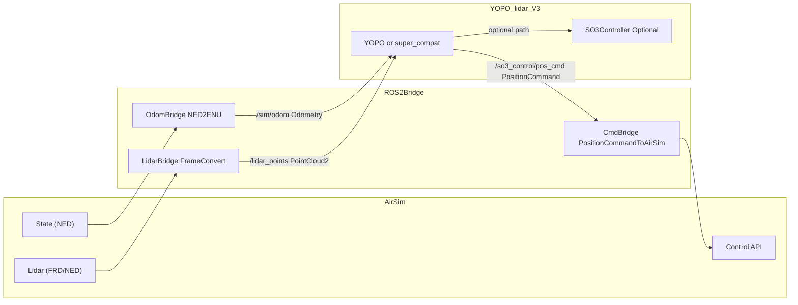

# YOPO_lidar_V3 适配 AirSim 详细教程

本教程面向 `YOPO_lidar_V3`，目标是把当前项目从内置仿真环境切到 AirSim，同时保持你现有 YOPO / SUPER-compat 两种规划方法可用。

---

## 1. 能不能对接 AirSim？

可以对接，但不是“直接替换一个 launch”就能完成。

### 1.1 结论

- **可行**：本项目对外核心依赖是 ROS2 话题接口，AirSim 可以通过桥接节点提供同等接口。
- **关键要求**：必须做坐标系统一（NED/ENU、FRD/FLU）和消息桥接。
- **不建议**：在不做桥接的前提下，直接让 AirSim 顶替 `so3_quadrotor_simulator + sensor_simulator`。

### 1.2 本项目当前关键接口（必须兼容）

- 里程计输入：`/sim/odom`，类型 `nav_msgs/msg/Odometry`
- 雷达输入：`/lidar_points`，类型 `sensor_msgs/msg/PointCloud2`
- 规划输出控制：`/so3_control/pos_cmd`，类型 `quadrotor_msgs/msg/PositionCommand`

对应实现可参考：

- `Controller/src/utils/yopo_bringup/launch/system.launch.py`
- `Controller/src/so3_control/src/network_control_ros2.cpp`
- `Simulator/src/src/sensor_simulator_ros2.cpp`

---

## 2. 推荐对接架构

推荐用一个 ROS2 桥接层，把 AirSim 适配成项目现有接口。



---

## 3. 两条接入路径（推荐 A）

## 路径 A（推荐）：Planner 直接控制 AirSim

- 数据流：`Planner -> /so3_control/pos_cmd -> CmdBridge -> AirSim API`
- 优点：结构简单，改动小，调参最少
- 缺点：桥接层要实现 PositionCommand 到 AirSim 控制映射

## 路径 B：经过 SO3 控制器再控制 AirSim

- 数据流：`Planner -> SO3 controller -> /so3_cmd -> Bridge -> AirSim`
- 优点：保留本项目 SO3 控制链路
- 缺点：桥接更复杂（需把力/姿态指令转 AirSim 控制），稳定性与调参成本更高

**建议**：先跑通路径 A，再考虑路径 B。

---

## 4. 坐标系统一（重点）

AirSim 默认常见坐标语义：

- 世界：NED（x 北, y 东, z 下）
- 机体系：FRD（x 前, y 右, z 下）

ROS 常用：

- 世界：ENU（x 东, y 北, z 上）
- 机体系：FLU（x 前, y 左, z 上）

你要统一到本项目当前使用的 world/ENU 风格（对应 `/sim/odom` 和 RViz `world`）。

## 4.1 位置/速度 NED -> ENU

设 AirSim 返回 `p_ned=[x_n,y_n,z_n]`，则：

- `x_enu = y_ned`
- `y_enu = x_ned`
- `z_enu = -z_ned`

速度同理按相同矩阵转换。

## 4.2 机体系 FRD -> FLU

- `x_flu = x_frd`
- `y_flu = -y_frd`
- `z_flu = -z_frd`

## 4.3 姿态（四元数）转换建议

不要手写欧拉角绕来绕去，建议用旋转矩阵链：

1. AirSim 四元数 -> `R_world_ned_body_frd`
2. 左乘 `R_enu_ned`，右乘 `R_frd_flu`，得到 `R_world_enu_body_flu`
3. 转回 ROS 四元数发布到 `/sim/odom`

建议在桥接里统一封装一个 `transform_utils.py`，所有状态/雷达/控制都走同一套变换函数。

---

## 5. 实施前检查

## 5.1 软件环境

- Ubuntu 22.04 + ROS2 Humble
- 本仓库已可正常运行原始流程（至少能跑起来）
- AirSim 可启动（UE 场景 + 无人机）

## 5.2 本项目最小可用基线

先验证你本项目本身接口没问题：

```bash
source /opt/ros/humble/setup.bash
source /home/duckcity/YOPO_lidar_V3/Controller/src/install_ros2/setup.bash
source /home/duckcity/YOPO_lidar_V3/Simulator/src/install_ros2/setup.bash

ros2 topic echo /sim/odom --once
ros2 topic echo /lidar_points --once
```

---

## 6. AirSim 桥接包建议结构（最小实现）

建议新建包：`airsim_bridge_ros2`（Python 版先落地最快）

```text
airsim_bridge_ros2/
  package.xml
  setup.py
  airsim_bridge_ros2/
    __init__.py
    transform_utils.py
    state_bridge.py
    lidar_bridge.py
    cmd_bridge.py
  launch/
    airsim_bridge.launch.py
  config/
    bridge.yaml
```

职责：

- `state_bridge.py`
  - 轮询 AirSim 状态
  - 做 NED->ENU + FRD->FLU
  - 发布 `/sim/odom`
- `lidar_bridge.py`
  - 读取 AirSim lidar
  - 点云变换后发布 `/lidar_points`（必要时再发 `/lidar_points_world`）
- `cmd_bridge.py`
  - 订阅 `/so3_control/pos_cmd`（`PositionCommand`）
  - 转 AirSim move API

---

## 7. 具体对接流程（命令级）

以下按“路径 A：planner 直控 AirSim”编排。

## 步骤 1：启动 AirSim

- 启动 UE 场景 + AirSim
- 在 `settings.json` 中确认启用了 multirotor 与 lidar（可先只开一个无人机）

## 步骤 2：启动桥接

```bash
source /opt/ros/humble/setup.bash
source /path/to/airsim_bridge_ws/install/setup.bash
ros2 launch airsim_bridge_ros2 airsim_bridge.launch.py
```

桥接至少要把以下话题打通：

- 发布：`/sim/odom`
- 发布：`/lidar_points`
- 订阅：`/so3_control/pos_cmd`

## 步骤 3：启动 YOPO 或 SUPER-compat（仅 planner）

避免重复仿真冲突，不要再启动本项目里的 `simulator_attitude_control` 和 `sensor_simulator`。

### SUPER-compat（你现有入口）

```bash
cd /home/duckcity/YOPO_lidar_V3
python policy/super/script/test_super.py
```

此脚本会启动 `super_compat_only.launch.py`（仅规划器）。

### YOPO（仅 planner 模式）

如果要用 YOPO 分支，建议单独起 `policy/YOPO/script/test_yopo_ros.py`，并显式指定话题：

```bash
cd /home/duckcity/YOPO_lidar_V3
conda activate yopo
python policy/YOPO/script/test_yopo_ros.py --ros_version ros2 \
  --weight policy/YOPO/saved/YOPO_1/epoch50.pth \
  --odom_topic /sim/odom \
  --lidar_topic /lidar_points \
  --ctrl_topic /so3_control/pos_cmd
```

## 步骤 4：RViz 发目标并验证

```bash
cd /home/duckcity/YOPO_lidar_V3
rviz2 -d visualization/yopo_ros2.rviz
```

用 `2D Goal Pose` 发目标，观察是否出现：

- planner 打印 `New goal`
- `/so3_control/pos_cmd` 有持续消息
- AirSim 无人机按目标移动

---

## 8. 验证清单（强烈建议逐条执行）

## 8.1 发布者/订阅者数量检查

```bash
ros2 topic info /sim/odom -v
ros2 topic info /lidar_points -v
ros2 topic info /so3_control/pos_cmd -v
```

关键判据：

- `/sim/odom` 应只有 **一个主发布者**（桥接）
- `/so3_control/pos_cmd` 应只有 **一个主发布者**（当前 planner）

若出现多个发布者（你之前的“两个无人机闪烁”），说明重复启动了仿真或 planner。

## 8.2 基础连通性

```bash
ros2 topic echo /sim/odom --once
ros2 topic echo /lidar_points --once
ros2 topic echo /so3_control/pos_cmd --once
```

## 8.3 坐标正确性快速测试

1. AirSim 原地静止，观察 `/sim/odom` 位置是否稳定
2. AirSim 向前小移动，检查 ENU 下 x/y 是否按预期变化
3. 给固定目标点，检查无人机是趋近目标而不是反向远离

---

## 9. 高频问题与排错

## 9.1 两架无人机闪烁/抖动

原因：重复发布（两个仿真节点或两个 planner 同时跑）。  
解决：

- 只保留一套状态源（AirSim bridge）
- 只保留一个 planner 发布 `/so3_control/pos_cmd`
- 用 `ros2 topic info -v` 检查 publisher 数量

## 9.2 明明有目标但不动

排查顺序：

1. planner 是否收到目标（日志有 `New goal`）
2. `/so3_control/pos_cmd` 是否有输出
3. `cmd_bridge` 是否正确订阅并调用 AirSim API
4. 坐标是否反了（常见是 z 或 yaw 方向错误）

## 9.3 点云看起来“倒着飞”或错位

通常是 frame 变换错：

- body/world 变换顺序错
- 用了欧拉角手算导致符号错
- 发布的 `frame_id` 与实际坐标不一致

---

## 10. 参数模板（桥接层建议）

可在 `config/bridge.yaml` 维护：

```yaml
topics:
  odom_out: "/sim/odom"
  lidar_out: "/lidar_points"
  cmd_in: "/so3_control/pos_cmd"

rates:
  state_hz: 100.0
  lidar_hz: 10.0
  cmd_hz: 50.0

frames:
  world_frame: "world"
  body_frame: "body"
  convert_ned_to_enu: true
  convert_frd_to_flu: true
```

---

## 11. 推荐上线顺序

1. 仅状态桥接（保证 `/sim/odom` 正确）
2. 加雷达桥接（保证 `/lidar_points` 正确）
3. 加命令桥接（只做悬停/小速度）
4. 接 SUPER-compat，完成点目标移动
5. 再接 YOPO，做同场景对比

---

## 12. 本仓库相关入口速查

- 全栈启动（含内部仿真）：`Controller/src/utils/yopo_bringup/launch/system.launch.py`
- SUPER-compat 仅 planner：`Controller/src/utils/yopo_bringup/launch/super_compat_only.launch.py`
- SUPER-compat Python 启动器：`policy/super/script/test_super.py`
- 适配说明：`SUPER_COMPAT.md`

---

## 13. 最终建议

如果你的目标是“尽快在 AirSim 上稳定飞起来”，按下面策略最稳：

- 先走 **路径 A（planner 直控 AirSim）**
- 先跑 `super_compat`，确认桥接链路稳定后再切 `yopo`
- 固定一个统一坐标模块，不要在多个节点重复写转换逻辑
- 每次只改一层：状态 -> 雷达 -> 控制，逐层验收

